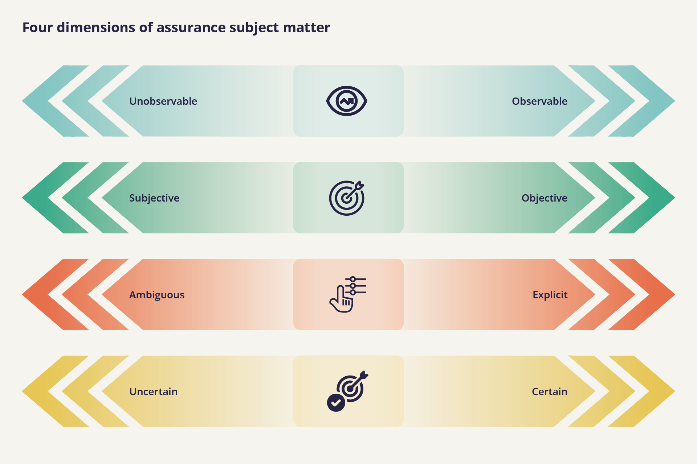

import CookieBanner from "../components/cookies"
import Collapse from "../components/collapse"
import OutboundLink from "../components/outbound-link"
import License from "../components/license"

<CookieBanner />

Whether someone needs to build confidence in the trustworthiness of different products, systems, processes, organisations or people will influence the type of information required, and the techniques required to provide assurance. This is because different products, systems, processes, organisations and people have different aspects that affect their trustworthiness i.e. they have different assurance subject matters.

For example, products such as simple tools or electronic devices can be manufactured according to easily standardisable and testable criteria against which their trustworthiness can be assessed. This is because the physical and electronic characteristics of these devices and easily definable applications that relate to their trustworthiness can be assessed objectively and with a high degree of certainty. E.g. whether a tool meets a clearly defined technical specification or a device passes an electronic safety test.

Assessing the trustworthiness of more complex products such as medical devices or industrial processes such as food production for example, is reliant upon a number of more complex interactions between people, technical and management processes which are more difficult to measure, require more judgement to assess effectively and produce risks which are more unpredictable. In these cases, assessments of trustworthiness have to deal with these more variable and complex socio-technical characteristics.

In light having different characteristics, different types of subject matter produce different strengths of evidence about risk and trustworthiness and require different methods of measurement and evaluation.

In the context of AI, the socio-technical complexity of AI systems means that there are many different types of subject matter that need to be assured, to ensure that a system is trustworthy as a whole, including: Robustness, accuracy, bias, explainability, privacy, security data quality/access/management, intended use, management processes and controls.

In particular, where the subject matter is not easily measurable or highly uncertain, for example potential societal impacts of using an AI system, this requires specific expertise and impact assessment procedures. Choosing an appropriate means of evaluation is critical. Adaptable and effective assessment practices should be developed by assurance providers to enable the evaluation of all kinds of AI technology and all assurable aspects of AI systems.

Below we highlight four important, interrelated characteristics that differ across the subject matters that relate to the trust and trustworthiness of AI systems and need to be assured.

**Whether a subject matter can be observed directly**

Some subject matters relevant to the trustworthiness of AI systems can be observed directly, through experiencing the outcome of a test or measurement. For example, testing the accuracy of an AI system for a specific task against a clear standard. Other subject matters cannot be observed directly, such as potential future harms resulting from the use of the system.

If the subject matter is unobservable e.g potential societal harms, proxies for these harms need to be assessed to provide assurance. This is the case for impact assessments, where impacts are proxies for future harms. To provide meaningful assurance about the potential societal harms resulting from the use of an AI system, the assessment criteria needs to be something observable that can provide us with reliable and verifiable information about the potential risk of societal harms occurring.

The most concrete and reliable observations we can make in this case are about the processes through which potential societal harms are managed i.e. how they can be identified, understood and mitigated. Impact assessment processes standardise methods for considering potential impacts and related harms, allowing assessors to assign appropriate accountability to mitigate known potential harms.

Similar processes are in place for organisational risk management. For example, the overarching goal of the ISO <OutboundLink href="https://www.iso.org/files/live/sites/isoorg/files/store/en/PUB100426.pdf">risk management standard</OutboundLink> is to develop a risk management culture where employees and stakeholders are aware of the importance of monitoring and managing risk.​ This risk management culture and awareness needs to be evaluated against the criteria to demonstrate trustworthy risk management.

**To what degree the measurement or assessment of performance is objective or subjective**

The distribution of outcomes from an AI system’s predictions can be ‘objectively’ measured according to a chosen metric. For example, false positive or false negative rates can be measured across different demographics. A different way of measuring fairness is the parity of outcomes across protected characteristics.

However, choosing which definition of fairness is appropriate in each context is subjective, relying on the judgement of the actor assessing the system. Definitions of fairness may also contradict one another - what is fair based on one metric might be unfair by another.

When a metric has been chosen and the distribution of outcomes from a system have been measured, a further subjective judgement needs to be made about what level of fairness/bias is acceptable. This benchmark will also differ based upon the context, for example, the level of bias deemed unacceptable is likely to be far lower in a high risk usage of AI for example, in a medical diagnostic tool compared to something like an AI enabled video game.

Taking account of the subjectivity of what is fair in different cases and contexts, we need to be realistic about what level of <OutboundLink href="https://standards.ieee.org/project/7003.html">technical standardisation</OutboundLink> is achievable. It is very unlikely that we’re going to get to a universal performance standard for algorithmic bias that is applicable everywhere.

However, we think that it will still be useful to get to commonly accepted definitions of how to measure bias, conventions on which definitions of fairness are more appropriate for different contexts while leaving it open to context how much bias is acceptable or necessary.

**Whether a subject matter is explicitly measurable, or ambiguous so it requires expert judgement**

Whether a subject matter is explicit or ambiguous reflects the level of consensus about how it should be assessed. The more ambiguous a factor/risk is the greater amount of judgement will be required to provide assurance.

The performance of an algorithm e.g. its accuracy in relation to a certain task can be measured against a specific metric. However, potential societal impacts resulting from the use of an AI system for example cannot be effectively quantified and require qualitative assessment. Furthermore measurements of bias require qualitative assessment as well as quantitative measurements of fairness. Without an assessment of the qualitative impacts of algorithmic bias in a specific context, it is unclear what quantitative level of bias is acceptable.

Because subject matter such as accuracy can be measured against quantitative metrics, assessments of accuracy can be automated and scaled-up, meaning accuracy can be assessed at a relatively lower cost. Subject matter that can only be measured qualitatively requires more context specific, expert judgement, meaning that is more costly and less easy to scale up.

**Whether the outcomes, risks or performance of the subject matter can be known with certainty, estimated probability or uncertainty**

The certainty of a risk occurring or being mitigated affects the strength of the assurance that can be provided. For example, ex-ante impact assessment can only account for potential impacts which can be anticipated before the system is deployed. In this case potential impacts are known with a significant degree of uncertainty.

Whether something can be known with certainty, probability or uncertainty affects the level of assurance that can be provided when an assessor provides a conclusion based on the available evidence. It is possible to assure against risks which are uncertain, what is important is that this uncertainty is reflected in the conclusions drawn from the evidence. The level of trust generated by an assurance conclusion must be appropriate for the level of certainty about the potential risks.

For this reason, assurance for potential societal impacts doesn’t specify that the system will achieve below an agreed benchmark for acceptable negative societal impact. Such assurance would provide false certainty due to its inability to effectively communicate the inherent uncertainty and unpredictability of broader societal impacts that can arise from the use of an AI system.

Assurance mechanisms need to be responsive to the level of certainty or uncertainty of the subject matter being measured. If a system is signed off as ‘risk free’, this conclusion might detract from the trustworthiness of the system, because with false certainty, the user might begin to ignore their primary responsibility to make effective judgements when using the system to ensure that its negative impacts are consistently identified and mitigated.

The assurance provided by an impact assessment relates to the process of carrying out an impact assessment itself, assigning accountability and mitigating known risk, rather than a speculative conclusion about societal outcomes.

<License />
