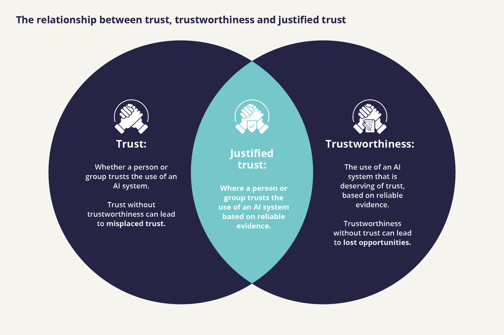

import CookieBanner from "../components/cookies"
import OutboundLink from "../components/outbound-link"
import License from "../components/license"

<CookieBanner />

Building and maintaining trust is crucial to realising the benefits of AI. If organisations don’t trust AI systems, they will be less willing to adopt these technologies because they don’t have the confidence that an AI system will actually work or benefit them. They might also not adopt for fear of facing reputational damage and public backlash. Without trust, consumers will also be cautious about using data-driven technologies, as well as sharing the data that is needed to build them.

The difficulty is, however, that these stakeholders often have limited information, or lack the appropriate specialist knowledge to check and verify others’ claims to understand whether AI systems are actually deserving of their trust.

This is where assurance is important. Being assured is about having confidence or trust in something, for example a system or process, documentation, a product or an organisation. Assurance engagements requires providing evidence - often via a trusted independent third party - to show that the AI system being assured is reliable and trustworthy

## Trust and Trustworthiness

The distinction between trust and trustworthiness is important here: when we talk about trustworthiness, we mean whether something is deserving of people’s trust. On the other hand, when we talk about trust, we mean whether something is actually trusted by someone, which might be the case even if it is not in fact trustworthy.

A successful relationship built on justified trust requires **both** trust and trustworthiness:

**Trust without trustworthiness = misplaced trust.** If we trust technology, or the organisations deploying a technology when they are not in fact trustworthy, we incur potential risks by misplacing our trust.

**Trustworthy but not trusted = (unjustified) mistrust.** If we fail to trust a technology or organisation which is in fact trustworthy, we incur the opportunity costs of not using good technology.

Fulfilling both of these requirements produces <OutboundLink href="https://www.immagic.com/eLibrary/ARCHIVES/GENERAL/BBC_UK/B020000O.pdf">**justified trust**</OutboundLink>.

## How AI Assurance builds Justified Trust

There are two key problems which organisations must overcome to build justified trust:

- **An information problem:** Organisations need to reliably and consistently evaluate whether an AI system is trustworthy to provide the evidence base for whether or not people should trust it.
- **A communication problem:** Organisations need to communicate their evidence to other assurance users and translate this evidence at the appropriate level of complexity so that they can direct their trust or distrust accordingly.

The value of assurance is overcoming both of these problems to enable justified trust.

Assurance requires measuring and evaluating a variety of information to show that the AI system being assured is reliable and trustworthy. This includes how these systems perform, how they are governed and managed, whether they are conforming with a technical standard or compliant with regulations, and whether they will reliably operate as intended. It therefore provides the evidence required to prove that a system is trustworthy.

Assurance engagements rely on clear metrics and standards against which organisations can communicate that their systems are effective, reliable and ethical. Assurance engagements therefore provide a process for making and assessing <OutboundLink href="https://arxiv.org/abs/2004.07213">verifiable claims</OutboundLink> to which organisations can be held accountable and for communicating these claims to the relevant actors so that they can build justified trust, where a system is deserving of their trust.

<License />
